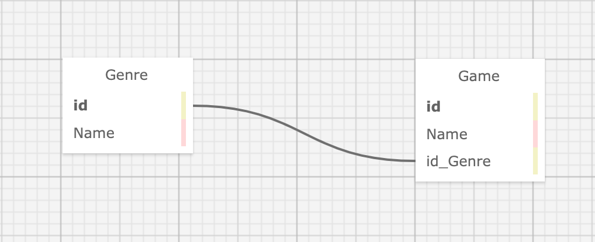

# Board Game Inventory
_by Kim Robinson & Noah Kise_

## An application to practice using EFCore and full CRUD functionality for c# .NET Mvc

###  This app will allow a user to:
    - Cread, read, update and delete game and genre of board games
    - Search for game by name

### Technologies Used

* C#
* .Net
* Git
* NuGet package with dotnet CLI
* EFCore

## Setup/Installation Requirements

_Currently not viewable on gh-pages. Please follow steps below to set up locally_

1. Navigate to [my github repository](https://github.com/kimmykokonut/BoardGame.Solution) for this project 

2. Click the `Fork` button and  you will be taken to a new page where you can give your repository a new name and description. Choose "create fork".

3. Click the `Code` button and copy the url for HTTPS.

4. On your local computer, create a working directory for my files and name appropriately.

5. On your terminal, type `$ git clone 'url'` (using the url from step 3.)

6. Once you have this on your local directory, if you ever want to push it to GitHub, you need to do these steps first so Git knows to ignore the obj and bin directories:
`$ git init` to initialize Git (if cloning, this step automatically happened)
`$ touch .gitignore` adds .gitignore file in the root directory. 

7. On your terminal, type `$ code .` to open in VS Code.  If you do not have VS Code Editor, you may download [here](https://code.visualstudio.com/)

8. In the .gitignore file, add `bin` and `obj` and save.
In the Terminal:
`$ git add .gitignore`
`$ git commit -m 'add .gitignore`
`$ git push origin main`

9. While in the terminal, navigate to the project's production directory currently called "ProjectName" and type `$ dotnet build` to compile the application's code.

10.  To use MSTest, you need to use the NuGet package manager to install the packages in the .csproj file.  Navigate to the ProjectName.Tests directory in the terminal and run the command `$ dotnet restore`

11.  Optionally you can use a file watcher so you don't have to restart the server every time the code changes. Run this command `$ dotnet watch run` to make the server automatically update.

12. In the terminal, type `$ dotnet run` (to compile and execute the console application ).

13. Enjoy!  You can close the development server at anytime by entering `ctrl` + `c` in the terminal.

* To run tests using MSTest, navigate to the ProjectName.Tests directory in your terminal and type `$ dotnet test`

## Known Bugs
* None known at this time

## License
MIT License. See license.md for further information
